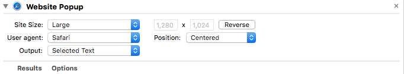

[QuickLook](https://en.wikipedia.org/wiki/Quick_Look) is the thing that lets you quickly preview content in finder, spotlight, and various apps. It is also easily used from the command line.

<!--break-->

```bash
$ cat ~/bin/ql

#!/bin/sh
qlmanage -p "$1"
```

Quicklook preview a web page from the command line on OS X:

```bash
$ cat ~/bin/qlurl

#! /bin/sh
automator -i "$1" ~/bin/urlpop.workflow
```

``urlpop.workflow``:



Various [QuickLook plugins](http://www.quicklookplugins.com/) are available from third parties.
